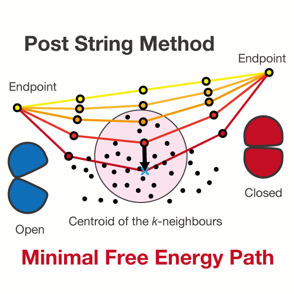
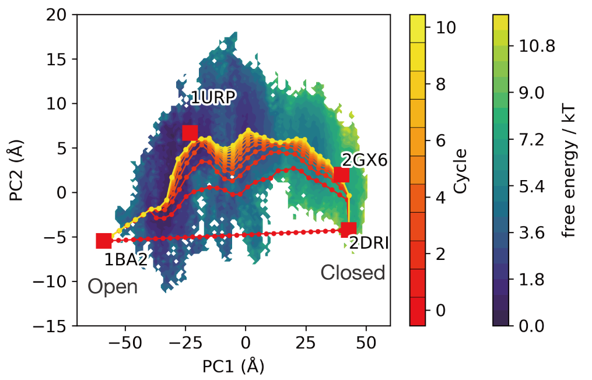
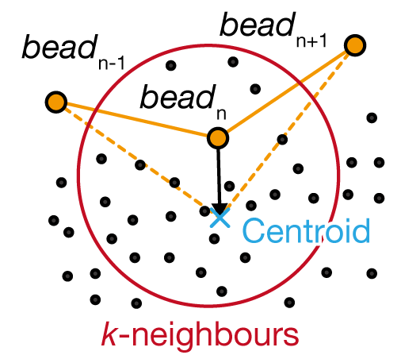

# Post String Method

The post sting method estimates the minimal free energy path on the free energy landscape.  

  
# DEMO  
Demonstration for the open-closed transition of ribose binding protein.

# Features
The replacement of the nth beads.  

 
# Requirement (validated version)
  
- Python 3.x (3.7.8)
 - matplotlib (3.3.1)
 - pyEMMA (2.5.7)
 - numpy (1.19.1)
 - tqdm (4.48.2)
 
# Installation
Launch string.ipynb and load post-string-input.xvg.
post-string-input.xvg should contain three column data (x, y, weight).

 
# Usage
 

 
# Note
Please cite this paper.
Rikuri Morita, Yasuteru Shigeta, Ryuhei Harada. A post-process to estimate an approximated minimal free energy path based on local centroids. Chem. Phys. Lett. (2021)DOI: https://doi.org/10.1016/j.cplett.2021.139003[https://doi.org/10.1016/j.cplett.2021.139003]

 
# Author
- Rikuri Morita
- Center for Computational Sciences, University of Tsukuba
- morita@ccs.tsukuba.ac.jp
 
# License
 
Post string method is under MIT license.
